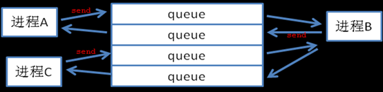

# 一个简单的消息队列


一个简单的消息队列，可以用于**同一台物理机**上面的两个不同的进程之间的通信。设用于一个进程写，一个进程读，这样可以避免考虑加锁的问题，实现比较高的性能。

## 实现的原理

实现的原理是通过共享内存的方式来存取消息，避免了消息因为进程挂掉之后丢失。同时，也不需要持久化保存消息，只要物理机不断电，就可以保证消息不丢失。

示意图：




## 如何使用

test_tbus 里面有一个首先要启动一个进程tbus_mgr,tbus_mgr进程负责读取xml配置文件读，创建共享内存和消息通道。

这个配置文件指明了要通信的进程双方，已经消息队列的大小。然后，在消息队列上面开辟出一块空间。
```
# 负责启动tbus_mgr进程 ，读取配置文件
debug/tbus_mgr/bin/start.sh 
```

这样其他的程序就可以include它的头文件，就可以使用了。
进程A,调用api发送一条消息
```
int tbus_shmkey = 2681;
mytbus_init(tbus_shmkey);                  #init

string dest_addr = "2.6.8.1";
string src_addr = "2.6.8.2";

char msg[] ="hello world";
char msg2[] ="hello pipap";
int msg_len = strlen(msg)+1;

mytbus_send(src_addr, dest_addr, msg, msg_len);    #调用发送的api，发送一条消息
```

进程B,调用api接受一条消息
```
int tbus_shmkey = 2681;
mytbus_init(tbus_shmkey);
string src_addr = "2.6.8.1";
string dest_addr = "0";

char * recv_msg = new char[20];
int recv_msg_len=0;

int ret = mytbus_recv(src_addr, dest_addr, recv_msg, recv_msg_len);    //调用接受的api，发送一条消息
printf("recv_msg : %s \n",recv_msg);
```

## 性能分析


## api接口


## 其他

